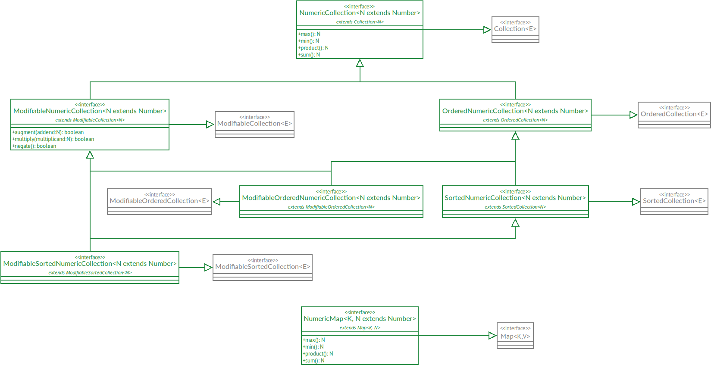

# Nombraj Kolektoj — Numeric Collections for Java

*“Nombraj kolektoj” is Esperanto for “numeric collections”.*

The aim of this project is to provide a numeric collection for Java, based on the
[Kolektoj](https://github.com/filipvanlaenen/kolektoj) Java Collections Framework.

* [Overview](#overview)
* [Getting Started](#getting-started)
* [Projects Using Kolektoj](#projects-using-kolektoj)

## Overview



## Getting Started

First of all, you need to obtain a copy of the source code, complile it and install it locally. Run the following
commands to do this:

```
git clone git@github.com:filipvanlaenen/nombrajkolektoj.git
cd nombrajkolektoj
mvn clean install
```

*Note: If requested by enough people, this library can be deployed to a central Maven repository
([Issue #1](https://github.com/filipvanlaenen/nombrajkolektoj/issues/1)).*

If everything works well, you'll be able to use the Nombraj Kolektoj library in another Java project by adding the
following dependency in the project's POM file:

```xml
  <dependency>
    <groupId>net.filipvanlaenen</groupId>
    <artifactId>nombrajkolektoj</artifactId>
    <version>1.0-SNAPSHOT</version>
  </dependency>
```

Be sure to update to the appropriate version number.

## Projects Using Nombraj Kolektoj

The following projects use Nombraj Kolektoj:
